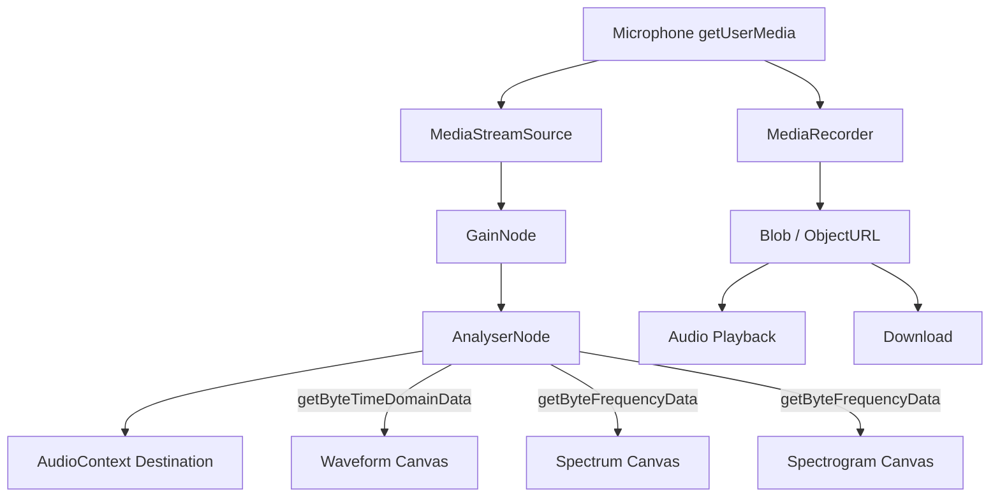

# Sound Wave Visualizer

A real-time audio visualization tool that records microphone input and displays a live waveform, frequency spectrum (FFT) and scrolling spectrogram — all built with the Web Audio API and Canvas 2D.

---

## Overview

Sound Wave Visualizer records microphone input using the Web Audio API and renders a live waveform, frequency spectrum and scrolling spectrogram via Canvas 2D. Recordings can be replayed in the browser or downloaded as audio files. It runs entirely in the browser with no server or dependencies.

---

## Purpose & Goals

- Demonstrate real-time audio processing using the Web Audio API's `AnalyserNode`
- Provide three complementary visualisation modes (waveform, spectrum, spectrogram) in one interface
- Allow users to record, replay and download microphone audio without any server infrastructure
- Keep the codebase self-contained so contributors can understand it in a single session

---

## Features

- **Live Waveform** — Oscilloscope-style amplitude-over-time display with RMS dB readout
- **Frequency Spectrum** — Real-time FFT bar chart with peak-frequency detection
- **Spectrogram** — Scrolling time-frequency heatmap showing how sound evolves
- **Recording & Playback** — Record sessions via the microphone and replay them in the browser
- **Download** — Save recordings as WebM/OGG audio files
- **Adjustable FFT Size** — 512 / 1024 / 2048 / 4096 bins for resolution vs. performance trade-off
- **Smoothing & Gain controls** — Fine-tune the analyser's temporal smoothing and input gain
- **5 Color Themes** — Cyan, Violet, Amber, Green and Rainbow

---

## How to Use

1. Open the page in a browser and click **Record** — allow microphone access when prompted
2. Speak, play music, or make any sound — all three visualisations update in real time
3. Click **Stop** (or the Record button again) to end the recording
4. Use **Play** to replay the recording or **Download** to save it
5. Adjust **FFT Size**, **Smoothing**, **Gain**, and **Color Scheme** at any time

---

## Running Locally

This project uses `getUserMedia` which requires a secure context (HTTPS or localhost).

```bash
# Using Python's built-in server
python3 -m http.server 8000
# Then open: http://localhost:8000/projects/misc/sound-wave-visualizer/
```

> ⚠️ Do **not** open `index.html` by double-clicking — the `file://` protocol blocks microphone access.

---

## Folder & File Structure

```text
sound-wave-visualizer/
├── index.html      # App shell, canvas elements, control bar, recordings list
├── style.css       # Dark-theme styling, responsive grid, recording rows
├── script.js       # Web Audio API, canvas rendering, MediaRecorder integration
├── thumbnail.svg   # Project thumbnail image
└── README.md       # Consolidated project documentation and technical architecture
```

---

## System & Project Architecture Overview

The project has a single-file JavaScript architecture centred on the Web Audio API graph:



- **Audio graph** is assembled once on first record; `GainNode` and `AnalyserNode` settings are updated live from the UI controls.
- **Animation loop** (`requestAnimationFrame`) reads `Uint8Array` buffers from the `AnalyserNode` and repaints all three canvases 60 fps.
- **MediaRecorder** runs in parallel, collecting audio chunks into a `Blob` for download or in-browser playback.

---

## Component Breakdown

| File | Responsibility |
|---|---|
| `index.html` | App structure: header, control bar, settings row, three canvas panels, recordings list |
| `style.css` | Design tokens, button styles, visualiser grid (2-col), recording rows, status pill animations |
| `script.js` | Audio graph, waveform / spectrum / spectrogram draw functions, MediaRecorder, playback, timer, event wiring |

---

## Data Flow / Execution Flow

```text
User opens index.html
        ↓
Browser loads style.css → script.js
        ↓
init() — canvases sized, idle placeholder drawn, status = "Ready"
        ↓
User clicks Record
        ↓
getUserMedia() → MediaStreamSource → GainNode → AnalyserNode
MediaRecorder.start() begins collecting audio chunks
        ↓
requestAnimationFrame loop fires every frame (~16ms)
        ↓
getByteTimeDomainData → drawWaveform()
getByteFrequencyData  → drawSpectrum()
getByteFrequencyData  → drawSpectrogram() (scrolling left by 1px each frame)
        ↓
User clicks Stop
        ↓
MediaRecorder.stop() → ondataavailable → Blob → ObjectURL
Recording entry pushed to `recordings` array → renderRecordings()
        ↓
User clicks Play / Download on a recording row
```

---

## Technologies Used

| Technology | Purpose |
|---|---|
| HTML5 Canvas 2D | Rendering waveform, spectrum bars and spectrogram pixels |
| Web Audio API | `AudioContext`, `AnalyserNode`, `GainNode`, `MediaStreamSource` |
| MediaDevices API | `getUserMedia` for microphone capture |
| MediaRecorder API | Capturing audio data for download and playback |
| CSS3 (Grid, Custom Properties, Animations) | Layout, theming and status-dot pulse animations |
| Vanilla JavaScript (ES6+) | All logic; no dependencies |
| Google Fonts (Outfit, JetBrains Mono) | Typography |

---

## File Responsibilities

### `script.js`

- `initAudio()` — Creates `AudioContext`, `AnalyserNode`, `GainNode`, wires graph
- `startRecording()` / `stopRecording()` — `getUserMedia` + `MediaRecorder` lifecycle
- `finalizeRecording()` — Assembles `Blob` from chunks, creates `ObjectURL`, pushes to `recordings`
- `drawWaveform(data)` — Oscilloscope with RMS dB using `getByteTimeDomainData`
- `drawSpectrum(data, bufferLength)` — FFT bar chart with magnitude-to-colour gradient
- `drawSpectrogram(data, bufferLength)` — Shifts canvas image left by 1 px, draws new column
- `playRecording(id)` / `stopPlayback()` / `togglePlayback(id)` — `Audio` element playback
- `renderRecordings()` — Generates HTML list of recording rows with event listeners
- `resizeCanvases()` — Responsive canvas sizing via `ResizeObserver`
- `hslToRgb()`, `blendColors()`, `lerp()` — Colour math utilities

### `style.css`

- `.status-dot.recording` — CSS `pulse-red` animation for live recording indicator
- `.vis-panel.wide` — spans full two-column grid width (spectrogram)
- `.bar-column` — FFT bars; coloured by JS via `fillStyle` per-draw
- `@keyframes pulse-red` / `pulse-green` — status dot glow animations

---

## Design Decisions

- **Shared `AnalyserNode` for all three visualisations** — A single `getByteTimeDomainData` and `getByteFrequencyData` call per frame feeds all canvases, avoiding redundant reads.
- **Spectrogram as image-shift** — Using `getImageData` / `putImageData` to shift the spectrogram canvas left by 1 pixel is the canonical, efficient approach for scrolling spectrograms without clearing the whole canvas each frame.
- **`MediaRecorder` runs alongside the audio graph** — Decoupled from `AnalyserNode`; the `MediaStream` is split into two branches: one for analysis, one for recording.
- **No external visualisation library** — Raw Canvas 2D keeps the project dependency-free and makes the rendering logic fully transparent to contributors.
- **`ResizeObserver` instead of `window.resize`** — More accurate for responsive canvas sizing when the parent container changes width due to layout shifts.

---

## Dependencies

None. Uses only native browser APIs:
- **Web Audio API** (`AudioContext`, `AnalyserNode`, `GainNode`)
- **MediaDevices API** (`getUserMedia`)
- **MediaRecorder API** (recording + download)
- **Canvas 2D API** (all visualisations)

---

## Future Improvements

- Beat / BPM detection using onset detection on the frequency data
- Note detection overlay using pitch detection (autocorrelation or YIN algorithm)
- Save spectrogram as a PNG screenshot
- Custom frequency-band highlighting (e.g. bass, mid, treble zones)
- Noise gate / threshold-triggered recording to skip silence

---

## Known Limitations

- Requires HTTPS or `localhost` — `getUserMedia` is blocked on insecure origins
- Recording format depends on browser support; typically WebM/Opus in Chromium, OGG in Firefox
- All recordings are in-memory only — refreshing the page clears them
- Spectrogram resolution is tied to canvas pixel width; very narrow viewports reduce time fidelity
- No audio processing (noise reduction, echo cancellation) is applied beyond the browser's default

---

## Development Notes

- Open `index.html` via `python3 -m http.server 8000` or any local server — not by double-clicking, as `file://` blocks `getUserMedia`.
- No build step required. Edit files and refresh the browser.
- On Chromium, inspect the audio graph in `chrome://webrtc-internals` or DevTools → Media panel.

---

## References

- [MDN Web Docs — Web Audio API](https://developer.mozilla.org/en-US/docs/Web/API/Web_Audio_API)
- [MDN Web Docs — AnalyserNode](https://developer.mozilla.org/en-US/docs/Web/API/AnalyserNode)
- [MDN Web Docs — MediaRecorder](https://developer.mozilla.org/en-US/docs/Web/API/MediaRecorder)
- [MDN Web Docs — getUserMedia](https://developer.mozilla.org/en-US/docs/Web/API/MediaDevices/getUserMedia)
